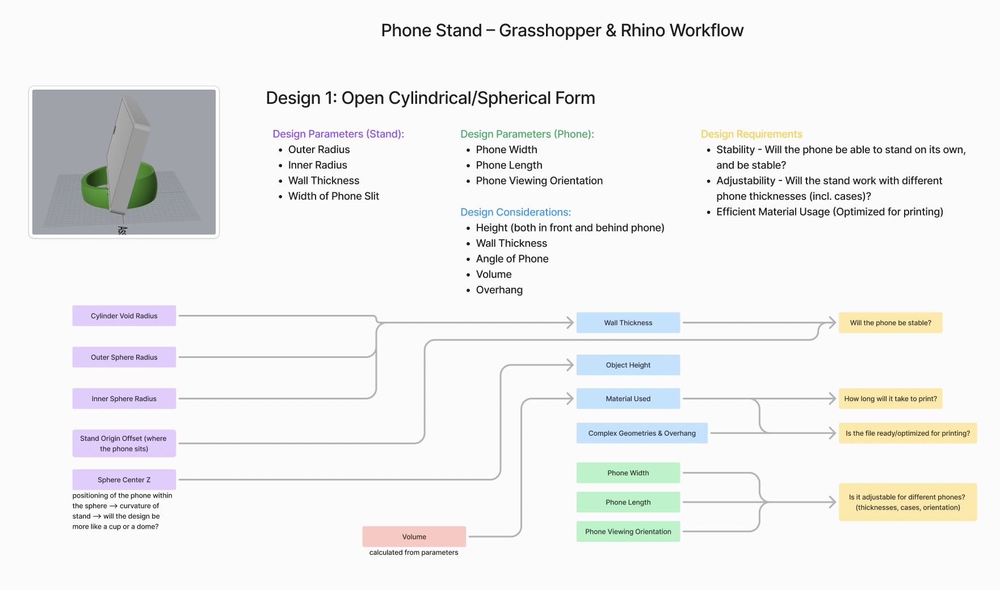
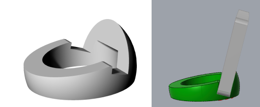
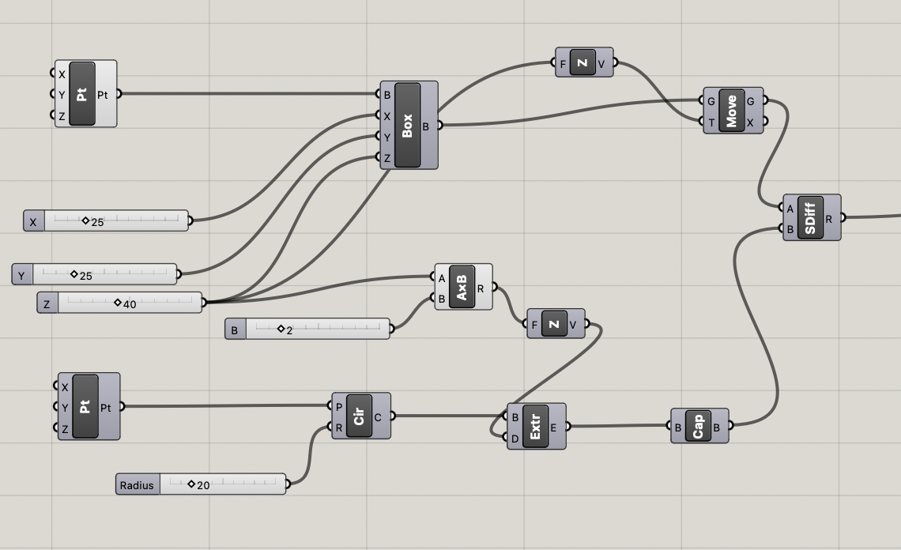
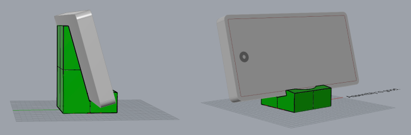
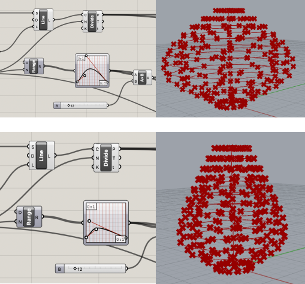
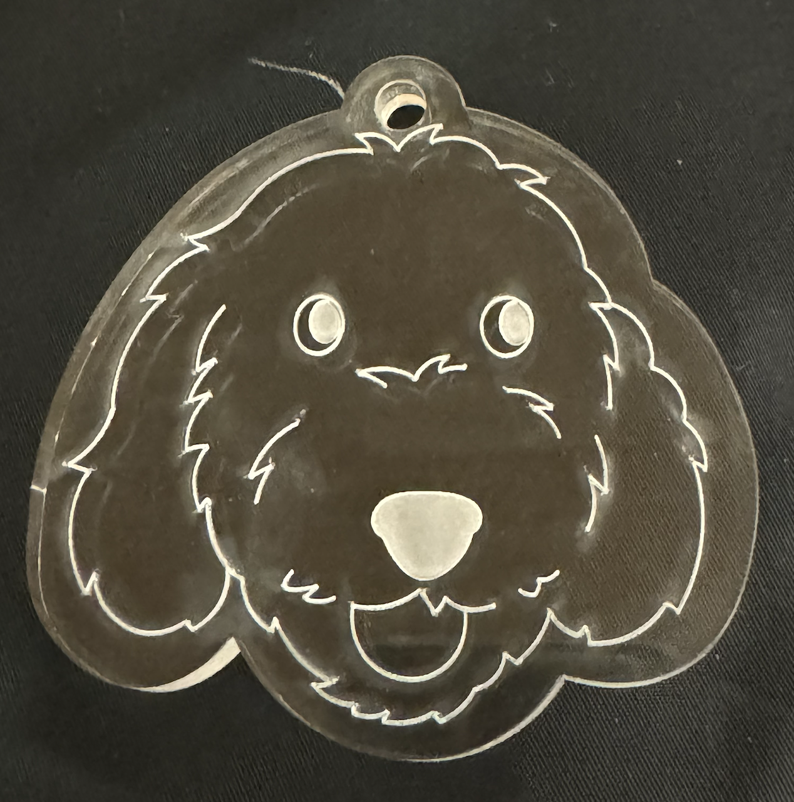

# Hello DES INV 202 Student!

# Outline
[week 1](README.md#week-1-report-1)  
[week 2](README.md#week-2-report-2)

---

# Week 2: Report 2 - 09/09/2024 #
<h3> Rhino & Grasshopper Example Workflow Diagram</h3>
To understand the final product, I tried to dissect the grasshopper file and make sense of the parameters, and how they impact the final design. In doing so, I brainstormed design considerations and overarching specificiations pertaining to the phone stand requirements. While my final model will likely not resemble the examples shared in class, the importance of the design considerations/specifications will translate to various forms. 
    

<h3>Learning Grasshopper Terms</h3>
<strong>Brep</strong>: <strong>B</strong>oundary <strong>Rep</strong>resentation = polysurface (in rhino); geometry type that represents the surface of an object with a set of connected surfaces  
 
<strong>Baking</strong>: pushes new geometry to Rhino based on the current state of the Grasshopper parameters. Note: once the object is baked, it unresponsive to any further tweaks in Grasshopper.

<h3>Reflections</h3>
<h4>Experimenting with Example Model</h4>
    
Using the example file, I played around with the parameters and baked a few forms. I was most interested in the offset from origin slider, and the diagram above shows an extreme case. While grasshopper counted this as a valid model, it is highly likely that this would not be able to balance the phone, given the far offset of the phone and the tilt angle. While it is difficult to quantify the balance and center of gravity, I am curious if a constraint can be put in place, with respect to the max offset of the phone, and how that could potentially mitigate balance issues.  

<h4>Experimenting with New Form</h4>
On Tuesday, I attended the grasshopper workshop, where we learned how to create a cube with a nested cylinder. It was challenging to follow along with the example since I was still unfamiliar with all the tools and commands. After class, I inputted the box model we made into the example file, and replaced the nested spheres. In doing so, the layout of the example file started to really make sense!   
    
    

<h3>Speculations</h3>
    
I followed a grasshopper tutorial on youtube on how to make a vase using bezier curves. While this was a bit outside of scope, it peaked my interest in how I could potentially utilize math and curves to make my phone stand. 
---

# Week 1: Report 1 – 09/05/2024 #

My focus of the week was to get reacquainted with CAD tools, and familiarize myself with Rhino which I have not used before. I followed a couple youtube tutorials outlining the Rhino interface, and practiced using the tools to model a watering can (not pictured because the app crashed before I saved - a good learning opportunity for future use). In my undergrad degree in engineering, I've used tools like Solidworks and Fusion360 for various academic and personal projects. My prior experience in CAD definitely helped in getting started with Rhino, since I am familiar with terms like 'extrude, sweep, revolve' etc, as well as visualizing how to model shapes from 2D sketches to 3D. However, there are noticeable differences in functionality/capability when comparing Rhino to more engineering-focused softwares. 

Differences I've noticed so far:
1. Solidworks is dimension-driven, and I heavily rely on the Smart Dimension tool when modeling. In Rhino, there is no tool to resize shapes after drawing. 
2. Rhino utilizes freeform surface modeling with NURBS (Non-Uniform Rational Basis Splines) Mathematical Model whereas Solidworks utilizes parametric modeling.
3. The freeform nature of Rhino is ideal for modeling organic shapes and curves. Solidworks is less compliant due to strict geometries. 

This week, I also got to try out the laser cutters at the Jacobs Makerspace! I have a 3D printer at home, but I've never been able to use a laser cutter before. I took a drawing I made of my dog, Cheeky, and redrew it in Adobe Illustrator. My initial cut with the laser cutter just etched the file instead of cutting through, but in my design I had specified an outer edge to be cut. The color and stroke of my lines were correct, but it appeared as black only on the laser cutting software. Through a bit of troubleshooting with file settings, particularly the way Adobe saves the file, I got a successful cut! The laser cutter is very efficient, as my keychain only took less than a minute to complete. I'm interested in ways I can incorporate this into future projects, both for MDes and art, especially with cutting acrylic sheets. 

    

[Wooj Design](https://wooj.design/?srsltid=AfmBOorDeVysMCg3r3KpSV4qGdLmuIJUsZzFeqlC6aK6UUAvHGMSMRW9) is a design company based in Brooklyn, NY, that produces 3D-printed home goods, and notably lighting fixtures. The most popular design is the [Wavy Lamp](https://wooj.design/collections/shop/products/lamp), which is entirely 3D-printed, and designed using Rhino and Grasshopper. This was how I initially discovered Rhino and Grasshopper, though I never fully explored the software. As a bit of a math nerd, I am excited to utilize these new functions in future projects!

---
