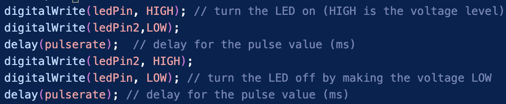
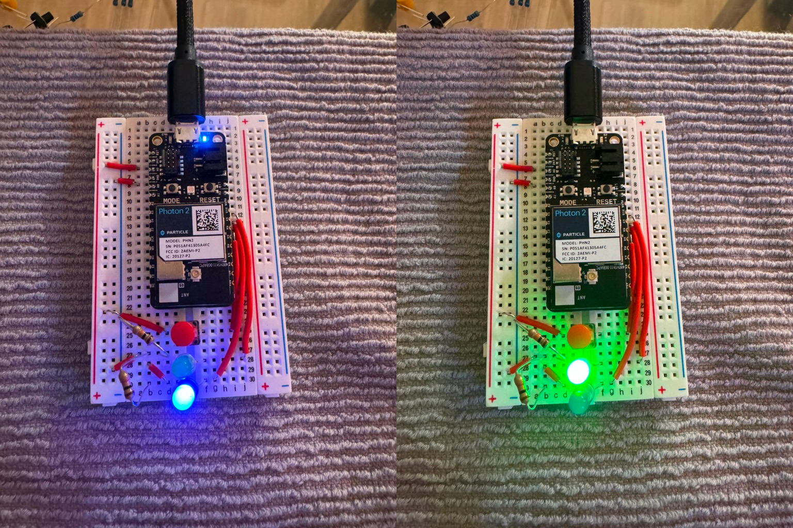
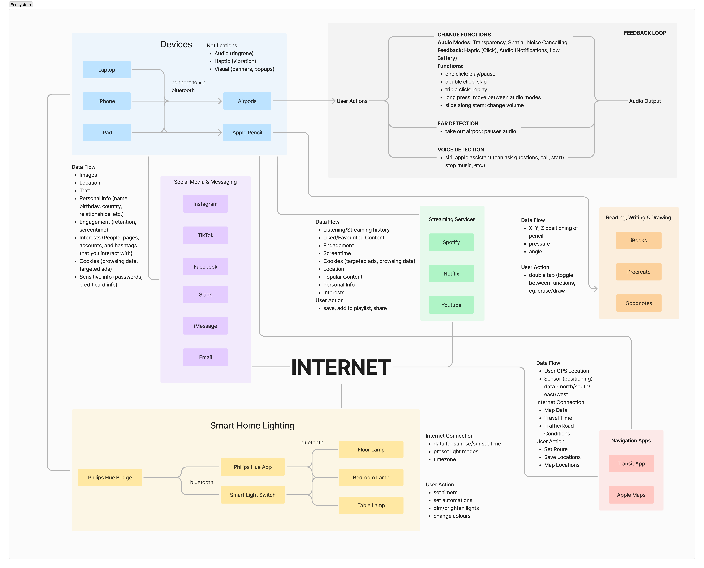
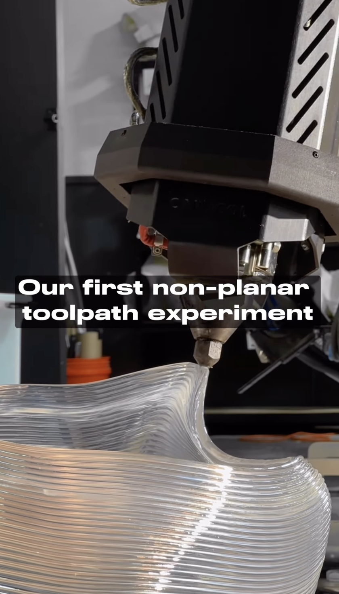
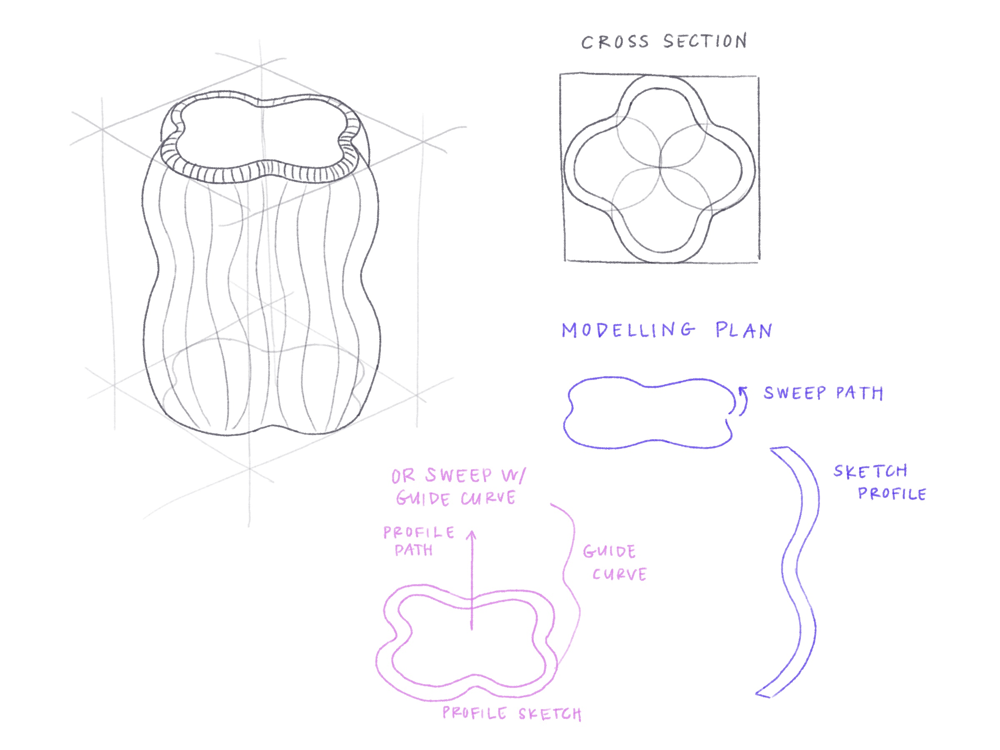
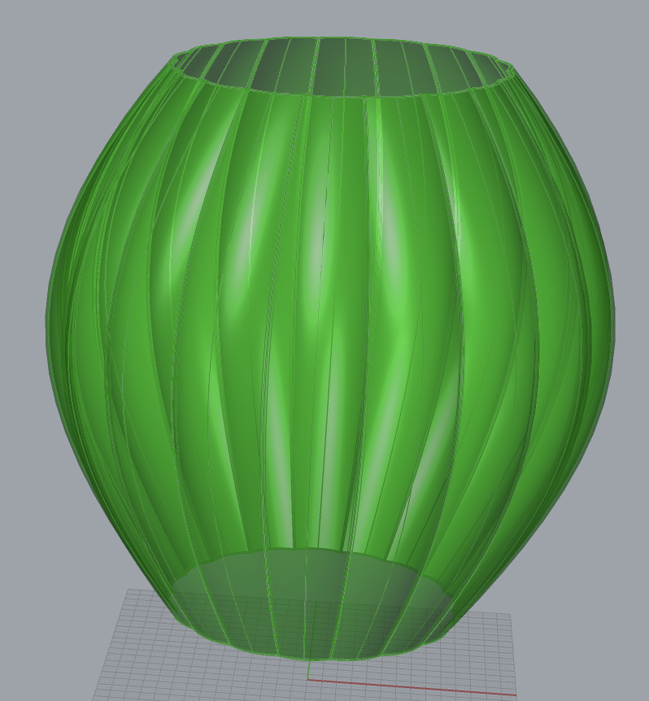
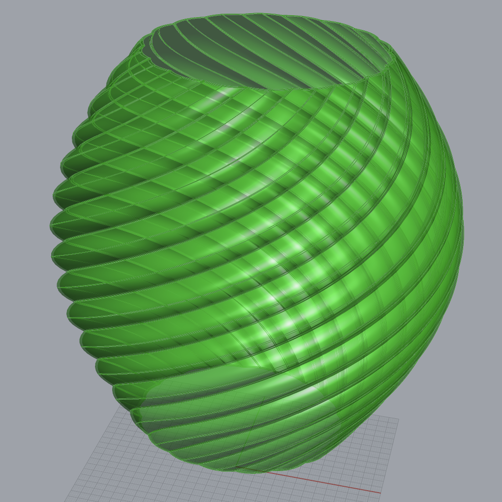
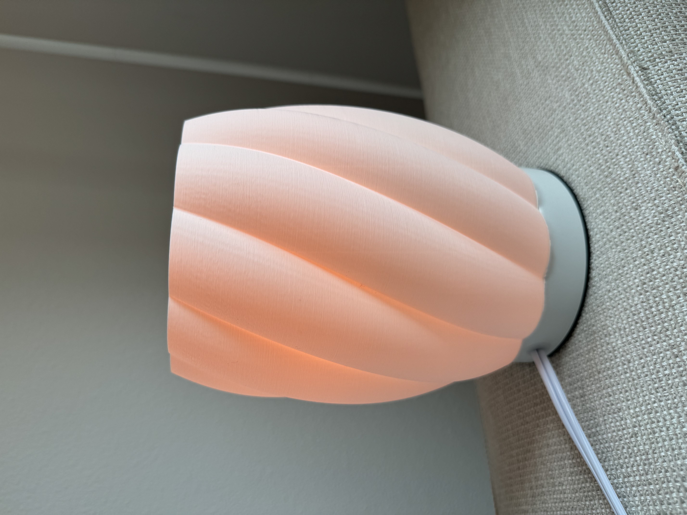

# Hello DES INV 202 Student!

# Outline
[week 1](README.md#week-1-report-1)  
[week 2](README.md#week-2-report-2)  
[week 3](README.md#week-3-report-3)  
[week 4](README.md#week-4-report-4)  
[week 5](README.md#week-5-report-5)  

---
# Week 5: Report 5 - 10/03/2024 #
<h3>Reflections</h3>
This week was dedicated to creating projects in particle, building circuits and flashing code. In the beginning of the week, I focused on the example folder given to the class, and worked on compiling and flashing. This was a good intro to some of the particle terminology and functions, and helped me get used to troubleshooting when the compile/flash wasn't working as anticipated. I then worked on the example particle.io tutorials, which each required a bit of troubleshooting to complete. 
<h4>Example 1: Button to LED Pulse Rate</h4>
After I built the initial circuit, I wanted to add a second LED, and code it to do something else when the button is pressed. I originally set up a global count variable and function in button_pressed that would increment the count. I then set up an if statement to turn on the LED2 if the count was even. However, I encountered issues with having both lights on. I did some troubleshooting, but decided to come back to this problem when I have a better understanding of little intricacies in the code and function order. This is the alteration I ended up doing: 

<h4>Example 2: FSR to RGB LED</h4>
Two resistor values: 
10k ohms (brown black orange) - easier to change colours, sensitive
100k ohms (brown black black orange yellow) - only showed magenta/blue, very sensitive
100 ohms (brown brown black black brown) - only magenta to blue to green
1k ohms (brown black red gold) - only magenta to green
<h4>Example 3: Button Send on change</h4>
<h4>Example 4: Publish/Subscribe</h4>

<h3>Speculations</h3>

---
# Week 4: Report 4 - 09/26/2024 #
This week was a transitional week between projects, so my main focus was getting set up and reacquainting myself with some tools I've worked with before. I've previously used microcontrollers on past projects, but I'm excited to start learning again! 

<h3>Reflections</h3>
The assignment this week was to create a Map of my Interactive Ecosystems. This was an interesting exercise as it forced me to think about all the data I create and consume throughout a single day. It also made me more mindful of my internet usage and digital footprint, and how I can consume less information and reduce my digital time, and go back to "analog" activities.  

<h4>Concept Map</h4>
The central node of my concept map is the Internet, and focuses around the devices I use in my daily life, and the applications I interact with. It includes six subsections: Devices, Social Media & Messaging, Streaming Services, Reading Writing & Drawing, Smart Home Lighting, and Navigation. I also included a feedback loop of how airpods receive user input action, and how it affects the audio output.  

I chose to do a concept map as it was the simplest way to suborganize an ecosystem of this scale, and still show the connections between them. For future maps, I would consider taking a subsection and creating a causal loop diagram showcasing the connections, the feedback and the behaviour of the system.

<h3>Speculations</h3>
In Studio Foundations, our end-of-module presentation is an ambient display. I decided to use a light module on the inside, and Chris gave me a esp32 feather and featherwing LED. I'm interested to see the capabilities of the light and how I can manipulate the form to change the light dispersion.

I've also noticed this past week I've gotten an influx of content about additive manufacturing and computational design (probably due to my Youtube watch history). I saw this video on instagram about a non-planar 3D printer! The nozzle is 7.5mm and it prints a layer height of 4mm. It prints in PETG, and can create objects as big as chairs in only 4 hours.  

---
# Week 3: Report 3 - 09/16/2024 #
This week, the main focus was on the project deliverables, as the project is coming to completion. After last Thursday's class, I decided to pivot from the phone stand and create a 3D printed lamp. Moving to Berkeley from BC, I wasn't able to bring a lot of extra items and furniture aside from the things that fit in my suitcases. My apartment lacks a lot of lighting, so I thought this would be a perfect opportunity to create something that I will use everyday.  

<h3>Reflections</h3>

I started with some rough sketching on the potential form and structure of the lamp. This helped me envision how I would make it in a software like Fusion360 (which was both helpful and frustrating). Grasshopper has such a different workflow, it was difficult in the beginning to rework my thinking, and build shapes in alternative ways.   

  

From the sketches, I moved on to Grasshopper, and making my dynamic model. The vase design from last week was particularly useful for implementing bezier curves, but it utilized a circular cross-section, and I wanted to make a more complex shape. I ended up utilizing the bezier curve, but also adding the element of a polar array, to pattern circles in the cross section. I also added a rotate element so the lamp design could have a twist element. After a series of lofts, merges and joins, I finally ended up with a closed brep set for baking! Special thank you to Cody for helping me troubleshoot :)  

  

<h3>My Final Lamp!</h3>

<h3>Speculations</h3>
The most fascinating part about designing this lamp was creating with parameters in mind, and creating relationships between the parameters and their respective geometries. To model my lamp system, I created a model for the lamp stand, lightbulb and lamp shade. While I only intended to print the lamp shade, having the whole system was very useful for visualizing parameters and relative size. I really like the aspect of being able to change parameters, and have the rest of the design be dependent on those changes. 

Another fascinating aspect about Grasshopper, while extremely challenging, is the use of data structures in CAD. In softwares like Fusion360 or Solidworks, if there is an error with carrying out an operation, it generally gives feedback that is slightly ambiguous. With Grasshopper, it provides more information on the data being passed to each component, which is often times the source of error, as data being passed is not always the same type or dimension. This was very tricky for me to troubleshoot as a new learner of Rhino and Grasshopper, but this was a good learning opportunity. I'm excited to continue learning and applying my foundational skills to another project, or maybe another lamp!

---
# Week 2: Report 2 - 09/09/2024 #
<h3> Rhino & Grasshopper Example Workflow Diagram</h3>
To understand the final product, I tried to dissect the grasshopper file and make sense of the parameters, and how they impact the final design. In doing so, I brainstormed design considerations and overarching specificiations pertaining to the phone stand requirements. While my final model will likely not resemble the examples shared in class, the importance of the design considerations/specifications will translate to various forms. 
    

<h3>Learning Grasshopper Terms</h3>
<strong>Brep</strong>: <strong>B</strong>oundary <strong>Rep</strong>resentation = polysurface (in rhino); geometry type that represents the surface of an object with a set of connected surfaces  
 
<strong>Baking</strong>: pushes new geometry to Rhino based on the current state of the Grasshopper parameters. Note: once the object is baked, it unresponsive to any further tweaks in Grasshopper.

<h3>Reflections</h3>
<h4>Experimenting with Example Model</h4>
    
Using the example file, I played around with the parameters and baked a few forms. I was most interested in the offset from origin slider, and the diagram above shows an extreme case. While grasshopper counted this as a valid model, it is highly likely that this would not be able to balance the phone, given the far offset of the phone and the tilt angle. While it is difficult to quantify the balance and center of gravity, I am curious if a constraint can be put in place, with respect to the max offset of the phone, and how that could potentially mitigate balance issues.  

<h4>Experimenting with New Form</h4>
On Tuesday, I attended the grasshopper workshop, where we learned how to create a cube with a nested cylinder. It was challenging to follow along with the example since I was still unfamiliar with all the tools and commands. After class, I inputted the box model we made into the example file, and replaced the nested spheres. In doing so, the layout of the example file started to really make sense!   
    
    

<h3>Speculations</h3>
    
I followed a grasshopper tutorial on youtube on how to make a vase using bezier curves. While this was a bit outside of scope, it peaked my interest in how I could potentially utilize math and curves to make my phone stand. 
---

# Week 1: Report 1 – 09/05/2024 #

My focus of the week was to get reacquainted with CAD tools, and familiarize myself with Rhino which I have not used before. I followed a couple youtube tutorials outlining the Rhino interface, and practiced using the tools to model a watering can (not pictured because the app crashed before I saved - a good learning opportunity for future use). In my undergrad degree in engineering, I've used tools like Solidworks and Fusion360 for various academic and personal projects. My prior experience in CAD definitely helped in getting started with Rhino, since I am familiar with terms like 'extrude, sweep, revolve' etc, as well as visualizing how to model shapes from 2D sketches to 3D. However, there are noticeable differences in functionality/capability when comparing Rhino to more engineering-focused softwares. 

Differences I've noticed so far:
1. Solidworks is dimension-driven, and I heavily rely on the Smart Dimension tool when modeling. In Rhino, there is no tool to resize shapes after drawing. 
2. Rhino utilizes freeform surface modeling with NURBS (Non-Uniform Rational Basis Splines) Mathematical Model whereas Solidworks utilizes parametric modeling.
3. The freeform nature of Rhino is ideal for modeling organic shapes and curves. Solidworks is less compliant due to strict geometries. 

This week, I also got to try out the laser cutters at the Jacobs Makerspace! I have a 3D printer at home, but I've never been able to use a laser cutter before. I took a drawing I made of my dog, Cheeky, and redrew it in Adobe Illustrator. My initial cut with the laser cutter just etched the file instead of cutting through, but in my design I had specified an outer edge to be cut. The color and stroke of my lines were correct, but it appeared as black only on the laser cutting software. Through a bit of troubleshooting with file settings, particularly the way Adobe saves the file, I got a successful cut! The laser cutter is very efficient, as my keychain only took less than a minute to complete. I'm interested in ways I can incorporate this into future projects, both for MDes and art, especially with cutting acrylic sheets. 

    

[Wooj Design](https://wooj.design/?srsltid=AfmBOorDeVysMCg3r3KpSV4qGdLmuIJUsZzFeqlC6aK6UUAvHGMSMRW9) is a design company based in Brooklyn, NY, that produces 3D-printed home goods, and notably lighting fixtures. The most popular design is the [Wavy Lamp](https://wooj.design/collections/shop/products/lamp), which is entirely 3D-printed, and designed using Rhino and Grasshopper. This was how I initially discovered Rhino and Grasshopper, though I never fully explored the software. As a bit of a math nerd, I am excited to utilize these new functions in future projects!

---
