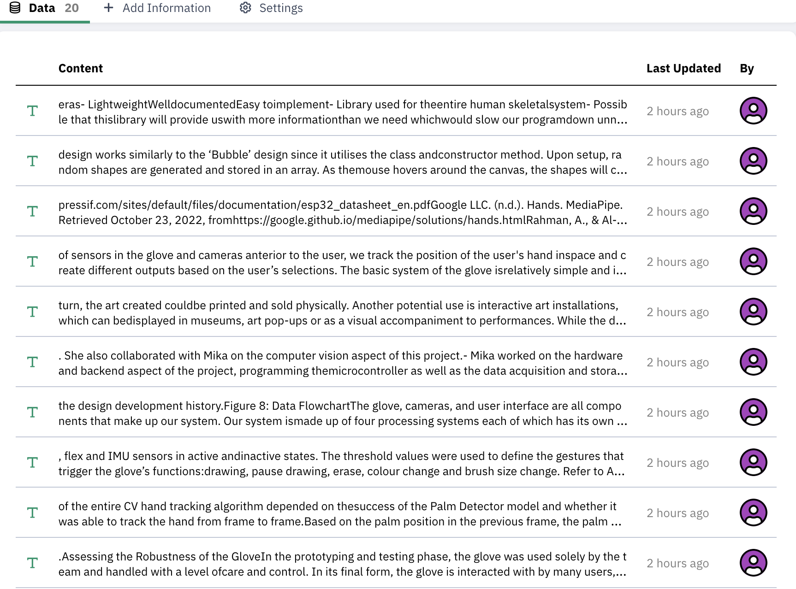
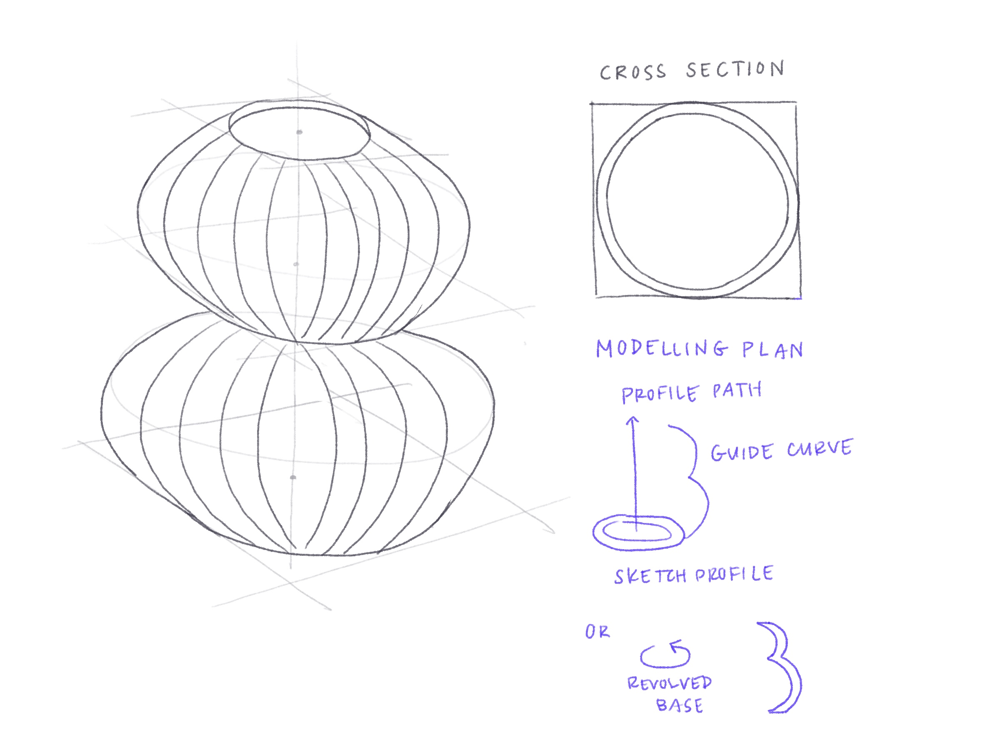

# Hi, I'm Kaylee – this is my worklog!

# Outline
[week 1](README.md#week-1-report-1)  
[week 2](README.md#week-2-report-2)  
[week 3](README.md#week-3-report-3)  
[week 4](README.md#week-4-report-4)  
[week 5](README.md#week-5-report-5)  
[week 6](README.md#week-6-report-6)  
[week 7](README.md#week-7-report-7)  
[week 8](README.md#week-8-report-8)  
[week 9](README.md#week-9-report-9)  

---
# Week 9: Report 9 - 10/24/2024 #
Last Thursday, we wrapped up project 2 and now we are moving onto LLMs! 
<h3>Reflections</h3>
<h4>Experiment 3: GPT, INSTRUCT & RAG</h4>

After running the initial experiments and getting used to the interface, I moved on to the GPT & RAG. Instead of uploading my resume, I was curious on how well the system could parse through technical information, and explain the functionalities. Thus, I uploaded my senior undergrad thesis project to the knowledge base (all 46 pages), which uploaded as a series of 20 chunks to my knowledge base. Then, I tested the agent flow with a variety of questions relating to features, purpose, team members, etc. For the most part, it was very accurate with parsing data. When I added the number slider to the temperature, a higher value corresponded to a likely incorrect response. 

For example, in my thesis, I worked with 3 other teammates. For some reason, it was very accurate with listing Beatrice and Josie, but in many cases it excluded Mika. I told the chatbot they forgot a member, and it returned the name Clarisse. When I increased the temperature, it gave me very bizarre answers: full names of three men. While I can understand why the names randomized with the temperature increase, I am not sure why Mika was excluded, as her name is present on the first page, along with the three of us. After I told the chatbot it made a mistake, it corrected it, without me having to change any sliders.  

  

A high number of chunks, but low similarity threshold, this did not return an answer.  

<h4>Experiment 4: GPT, INSTRUCT, RAG & VARIABLES</h4>
The introduction of variables I found to be particularly useful and interesting. 

<h3>Speculations</h3>
I'm interested in the 'Web' section in the ZeroWidth toolbar, and how we can utilize and incorporate API Data. I am curious about the integration and future applications that can come out of it – eg. parsing data from API, and adding it to a knowledge base. It seems like ZeroWidth has the capabilities to make easy integration of these different components, and I am excited to see how I can further utilize this data and export it to something else. For example, in our last project, we had a lot of data in the JSON output. For more complex things, maybe we would want to use the time stamp or more parameters, and further manipulate the data. ZeroWidth also has tools for math and digital logic. I appreciate the visual nature of this software, and am excited to learn more on how to utilize its functions.

---
# Week 8: Report 8 - 10/24/2024 #
This week, my team and I wrapped up our jellyfish project! Integration of all parts went smoothly and I'm very happy with the final product :-)
<h3>Reflections</h3>
<h4>Gesture Sensor</h4>
Last week, I was having issues with the proximity, light and gesture sensor reading and detecting gestures. The code I originally used did not work, but this past Monday it was able to flash and detect gestures! I'm not sure if it was a particle photon glitch, library error or maybe user error (me doing the gestures). However after I got it to flash it worked very consistently. 
<h4>Webhooks --> Websockets? --> Particle Cloud API </h4>
In our project proposal, we considered using either p5.js or TouchDesigner to create the visual display for the jellyfish environment. To do so, I experimented publishing the gesture data as a cloud variable, and also as a cloud event. A big question last week was how exactly I was going to forward the data from the particle cloud, to be developed into visuals. I tried creating a custom webhook, but realized that is likely not easily compatible with the TouchDesigner functions/interface. I also considered using the Google Cloud to forward the data using WebSockets, but decided to use the native tools to Particle: the Particle Cloud API. 

 

In TouchDesigner, there is a function block that allows API data to be accessed, called a WebClient block. However, as the event data is constantly being published, the WebClient needs to be constantly triggered. I was having issues with this, and was not able to have a consistent data input stream despite many hours of troubleshooting. I talked to a Cohort 4 team that used TouchDesigner last year, and they only managed to access the particle data using a serial port. I considered using another photon to subscribe to the gesture data, but this in hindsight would've been more complicated, as we already used 1 photon for the electronics and 1 photon for the gesture sensor publishing. If we did this method, our digital ecosystem would be 3 photons. Ultimately, I chose to use p5.js to manipulate the gesture data into visuals as it was the most responsive and reliable, and was able to access the JSON data consistently. For the final prototype, I embedded the sketch into a React Webapp. 

<h3>Speculations</h3>
I enjoyed exploring the world of APIs and cloud data, and I was impressed at how accessible the data is through the Particle Cloud API. In past projects that involved any data, I never worked on the integration of physical to digital, so this was a good learning experience. While it was challenging to test out the methods and troubleshoot, I am excited to continue to work on physical to digital interaction with the photon! While we decided to pivot to p5.js, I would like to explore the TouchDesigner interface. I speculate that the cloud API might not be the best method for this, and in the future will possibly explore using a backend server, webapp and Websockets. Maybe will work on a physical to TouchDesigner to LED light display for our jellyfish, or other underwater friends.
 

---
# Week 7: Report 7 - 10/17/2024 #
This week, I continued working on project 2, and mainly worked on testing sensors! Unfortunately, I got sick this week which slowed down my ability to work, but I still made some progress :)
<h3>Reflections</h3>
For our project, we considered using many different sensors, but wanted to try them each out to see if they fit our project/function needs. Our jellyfish display will have parts that are moved by a servo motor and a vibration motor, which are controlled by various sensors. 
<h4>Vibration</h4>
A feature we wanted to implement was the vibration of the jellyfish when a hand was close to the bell(head). This was a good experiment to test 1. the strength of the vibration disk & haptic driver, and 2. the reliability of the ultrasonic sensor data. To implement this, I created a circuit and corresponding code to make disk vibrate if there was an object within <3cm range of the ultrasonic sensor. I was surprised that the DRV2605 library for the haptic driver had over 120 different modes! I tested around 5 of the most promising modes, which included Strong Buzz 100%, Buzz 100%, Pulsing Strong 100%. It was hard to tell the difference but ultimately, I drew the conclusion that the vibration was not very powerful, and it might not be noticeable to use as a movement source for the jellyfish. However, I was happy to see the ultrasonic sensor was working well! 

<h4>Light, Proximity & Gesture Sensor </h4>
I was excited to try this sensor as I've never worked with it before! We were interested with using this sensor to control the background visuals (for the jellyfish digital habitat). I ran into some issues with accessing the gesture data – not sure if the issue is related to the library, but I will continue to troubleshoot. However, Lauryn was able to access the data on her computer, so I'm sure it is a resolvable issue. I am interested in using the proximity and/or gesture data to control visuals in touchdesigner. I wrote the code to publish the data, and am working on the method of accessing the data through webhooks, and a local host (and using ngrok since you can't add localhost directly in the custom webhook integration). I set up the webhook, and will continue to work on how I can access and manipulate this data in touchdesigner. 
<h3>Speculations</h3>
Even though I've worked with sensors in past projects, using webhooks and sending/accessing data through the cloud is completely foreign to me, and is challenging as I don't feel particularly strong in coding/computer stuff. ChatGPT has been a good resource for complex but also simple problems, such as finding my IP address and available ports. I have been doing a lot of research on different methods, and have decided to go with the ngrok route for using webhooks with localhost. I considered using google cloud potentially using WebSockets to forward the data to TouchDesigner, but I think webhooks and localhost is a more straightforward path. I will continue to TouchDesigner, where I anticipate I will run into a web of other problems to troubleshoot, but I think I have an idea on how to integrate these two things. I am excited to work with TouchDesigner for the first time, and I think it will be cool to make a responsive background display which is synced with the movements from the jellyfish! There are a lot of good resources online that I will learn and draw inspiration from.
   

---

# Week 6: Report 6 - 10/10/2024 #
This week, we explored sensing options and formed groups for project 2! 
<h3>Reflections</h3>
In order to use the sensors, we first had to solder the Stemma board to connect it to the various sensors. I had soldered before in my undergrad, but it definitely took a few pins to get used to soldering again.

After soldering, I loaded the two test stemma files for the accelerometer/gyroscope and the potentiometer to OLED. These outputs were just logged in the serial plot, but it's interesting to think about how I could apply these values to some other physical or digital outputs. In my capstone project, we used the same accelerometer/gyroscope for an interactive sensor glove to create digital art. In this project, we primarily used the roll axis of rotation to capture the twisting of the wrist, which then changed the brush size in the digital interface. For our current project, I'm interested in seeing if we could potentially use the linear and angular change in speed and acceleration to manipulate the visual background display.  

For this digital ecosystem project, I am working with Lauryn and Chantal, to create an interactive jellyfish with a corresponding audiovisual background display. We plan to test and use various sensors, and see how we can use this data to change our outputs. In the next week, we are going to implement distance sensors (ultrasonic, time of flight), force sensors, vibration motors, light-proximity-gesture sensor and potentially accelerometer/gyroscope. 

<h3>Speculations</h3>

(https://www.simonaa.media/tutorials/tag/touchdesigner) 
TouchDesigner is a visual development platform that is commonly used for making interactive visual displays. I have personally never used it before, but I've always been fascinated with integrating the technology with physical sensing and manipulation. For example, I've seen it combined with a MIDI controller, and used as a way to create a linked visual display to a DJ set. I speculate that this could be a perfect tool to create our interactive background display visuals for our project, combined with various sensing inputs.  

Another tool we are interested in using is MAX/MSP, which is a visual programming language for music and multimedia. This semester, I tried to take MUSIC 158A, sound and music computing, but was unable to get off the waitlist. However, I attended the first couple weeks of class and was super interested in the technology, and how I could further integrate it with physical inputs. 

An overarching goal of mine is to create an interactive audiovisual instrument that responds to physical manipulation. My inspiration stems from synesthesia, which is a condition that causes people to experience one sense through another, such as seeing colors when they hear music. I imagine this to follow a similar form to the suzuki omnichord, but also interact with a gradient light display. I intend to make this either through a school or personal project, but I am excited to further develop my skills in sensor and cloud interaction through this digital ecosystem project. 

---
# Week 5: Report 5 - 10/03/2024 #
<h3>Reflections</h3>
This week was dedicated to creating projects in particle, building circuits and flashing code. In the beginning of the week, I focused on the example folder given to the class, and worked on compiling and flashing. This was a good intro to some of the particle terminology and functions, and helped me get used to troubleshooting when the compile/flash wasn't working as anticipated. I then worked on the example particle.io tutorials, which each required a bit of troubleshooting to complete. 
<h4>Example 1: Button to LED Pulse Rate</h4>
After I built the initial circuit, I wanted to add a second LED, and code it to do something else when the button is pressed. I originally set up a global count variable and function in button_pressed that would increment the count. I then set up an if statement to turn on the LED2 if the count was even. However, I encountered issues with having both lights on. I did some troubleshooting, but decided to come back to this problem when I have a better understanding of little intricacies in the code and function order. This is the alteration I ended up doing: 

I set up the LEDs to just alternate in blinking, so if LED1 was high (on), then LED2 was low (off).

<h4>Example 2: FSR to RGB LED</h4>
The next example I completed was the FSR to RGB LED. I initially had this working and then I altered the circuit which unfortunately stopped it from working. After remaking it (a couple times), it finally started flashing again, and I think part of the problem was due to the resistors.  

Because of the threshold values in the code for the FSR, certain resistors only allowed for certain colours, due to the resistance values. This is what I documented:
10k ohms (brown black orange) - easier to change colours, sensitive
100k ohms (brown black black orange yellow) - only showed magenta/blue, very sensitive
100 ohms (brown brown black black brown) - only magenta to blue to green
1k ohms (brown black red gold) - only magenta to green

<h4>Example 3: Button Send on change</h4>
This was a good example to learn how to see events on the particle website! 

<h4>Example 4: Publish/Subscribe</h4>
I had a bit of trouble doing this example, as I wasn't familiar with publishing and subscribing, and accessing the particle cloud. For a while, it was just showing 'pending' in the events, but I finally was able to see the photoLed changes. However, I am still having a bit of troubles with the subscribe function.

<h3>Speculations</h3>
This was a good intro to the tools and functions of particle, and I am particularly interested in the publish/subscribe functions and how this could be applied to working in teams! I am going to continue to troubleshoot this, and hopefully have two photons communicating with each other. For my final project in Studio Foundations, I used a feather M0 and a adafruit 4x8 neopixel to make an ambient lighting display, which I coded in arduino. I also bought some 8x8 dot matrix grids, and I am hoping to implement these with my particle board in the next week, maybe using a motion sensor as well. This reminded me of those speeding sensors the city places on the side of roads, which flash you a happy face or a sad face depending on the speed. I have some extra electronic components from my undergrad, and I am going to continue to experiment with using them with my photon.  
 
Here is a picture of my final project for studio:

---
# Week 4: Report 4 - 09/26/2024 #
This week was a transitional week between projects, so my main focus was getting set up and reacquainting myself with some tools I've worked with before. I've previously used microcontrollers on past projects, but I'm excited to start learning again! 

<h3>Reflections</h3>
The assignment this week was to create a Map of my Interactive Ecosystems. This was an interesting exercise as it forced me to think about all the data I create and consume throughout a single day. It also made me more mindful of my internet usage and digital footprint, and how I can consume less information and reduce my digital time, and go back to "analog" activities.  

<h4>Concept Map</h4>
The central node of my concept map is the Internet, and focuses around the devices I use in my daily life, and the applications I interact with. It includes six subsections: Devices, Social Media & Messaging, Streaming Services, Reading Writing & Drawing, Smart Home Lighting, and Navigation. I also included a feedback loop of how airpods receive user input action, and how it affects the audio output.  

I chose to do a concept map as it was the simplest way to suborganize an ecosystem of this scale, and still show the connections between them. For future maps, I would consider taking a subsection and creating a causal loop diagram showcasing the connections, the feedback and the behaviour of the system.

<h3>Speculations</h3>
In Studio Foundations, our end-of-module presentation is an ambient display. I decided to use a light module on the inside, and Chris gave me a esp32 feather and featherwing LED. I'm interested to see the capabilities of the light and how I can manipulate the form to change the light dispersion.

I've also noticed this past week I've gotten an influx of content about additive manufacturing and computational design (probably due to my Youtube watch history). I saw this video on instagram about a non-planar 3D printer! The nozzle is 7.5mm and it prints a layer height of 4mm. It prints in PETG, and can create objects as big as chairs in only 4 hours.  

---
# Week 3: Report 3 - 09/16/2024 #
This week, the main focus was on the project deliverables, as the project is coming to completion. After last Thursday's class, I decided to pivot from the phone stand and create a 3D printed lamp. Moving to Berkeley from BC, I wasn't able to bring a lot of extra items and furniture aside from the things that fit in my suitcases. My apartment lacks a lot of lighting, so I thought this would be a perfect opportunity to create something that I will use everyday.  

<h3>Reflections</h3>

I started with some rough sketching on the potential form and structure of the lamp. This helped me envision how I would make it in a software like Fusion360 (which was both helpful and frustrating). Grasshopper has such a different workflow, it was difficult in the beginning to rework my thinking, and build shapes in alternative ways.   

  

From the sketches, I moved on to Grasshopper, and making my dynamic model. The vase design from last week was particularly useful for implementing bezier curves, but it utilized a circular cross-section, and I wanted to make a more complex shape. I ended up utilizing the bezier curve, but also adding the element of a polar array, to pattern circles in the cross section. I also added a rotate element so the lamp design could have a twist element. After a series of lofts, merges and joins, I finally ended up with a closed brep set for baking! Special thank you to Cody for helping me troubleshoot :)  

  

<h3>My Final Lamp!</h3>

<h3>Speculations</h3>
The most fascinating part about designing this lamp was creating with parameters in mind, and creating relationships between the parameters and their respective geometries. To model my lamp system, I created a model for the lamp stand, lightbulb and lamp shade. While I only intended to print the lamp shade, having the whole system was very useful for visualizing parameters and relative size. I really like the aspect of being able to change parameters, and have the rest of the design be dependent on those changes. 

Another fascinating aspect about Grasshopper, while extremely challenging, is the use of data structures in CAD. In softwares like Fusion360 or Solidworks, if there is an error with carrying out an operation, it generally gives feedback that is slightly ambiguous. With Grasshopper, it provides more information on the data being passed to each component, which is often times the source of error, as data being passed is not always the same type or dimension. This was very tricky for me to troubleshoot as a new learner of Rhino and Grasshopper, but this was a good learning opportunity. I'm excited to continue learning and applying my foundational skills to another project, or maybe another lamp!

---
# Week 2: Report 2 - 09/09/2024 #
<h3> Rhino & Grasshopper Example Workflow Diagram</h3>
To understand the final product, I tried to dissect the grasshopper file and make sense of the parameters, and how they impact the final design. In doing so, I brainstormed design considerations and overarching specificiations pertaining to the phone stand requirements. While my final model will likely not resemble the examples shared in class, the importance of the design considerations/specifications will translate to various forms. 
    

<h3>Learning Grasshopper Terms</h3>
<strong>Brep</strong>: <strong>B</strong>oundary <strong>Rep</strong>resentation = polysurface (in rhino); geometry type that represents the surface of an object with a set of connected surfaces  
 
<strong>Baking</strong>: pushes new geometry to Rhino based on the current state of the Grasshopper parameters. Note: once the object is baked, it unresponsive to any further tweaks in Grasshopper.

<h3>Reflections</h3>
<h4>Experimenting with Example Model</h4>
    
Using the example file, I played around with the parameters and baked a few forms. I was most interested in the offset from origin slider, and the diagram above shows an extreme case. While grasshopper counted this as a valid model, it is highly likely that this would not be able to balance the phone, given the far offset of the phone and the tilt angle. While it is difficult to quantify the balance and center of gravity, I am curious if a constraint can be put in place, with respect to the max offset of the phone, and how that could potentially mitigate balance issues.  

<h4>Experimenting with New Form</h4>
On Tuesday, I attended the grasshopper workshop, where we learned how to create a cube with a nested cylinder. It was challenging to follow along with the example since I was still unfamiliar with all the tools and commands. After class, I inputted the box model we made into the example file, and replaced the nested spheres. In doing so, the layout of the example file started to really make sense!   
    
    

<h3>Speculations</h3>
    
I followed a grasshopper tutorial on youtube on how to make a vase using bezier curves. While this was a bit outside of scope, it peaked my interest in how I could potentially utilize math and curves to make my phone stand. 
---

# Week 1: Report 1 – 09/05/2024 #

My focus of the week was to get reacquainted with CAD tools, and familiarize myself with Rhino which I have not used before. I followed a couple youtube tutorials outlining the Rhino interface, and practiced using the tools to model a watering can (not pictured because the app crashed before I saved - a good learning opportunity for future use). In my undergrad degree in engineering, I've used tools like Solidworks and Fusion360 for various academic and personal projects. My prior experience in CAD definitely helped in getting started with Rhino, since I am familiar with terms like 'extrude, sweep, revolve' etc, as well as visualizing how to model shapes from 2D sketches to 3D. However, there are noticeable differences in functionality/capability when comparing Rhino to more engineering-focused softwares. 

Differences I've noticed so far:
1. Solidworks is dimension-driven, and I heavily rely on the Smart Dimension tool when modeling. In Rhino, there is no tool to resize shapes after drawing. 
2. Rhino utilizes freeform surface modeling with NURBS (Non-Uniform Rational Basis Splines) Mathematical Model whereas Solidworks utilizes parametric modeling.
3. The freeform nature of Rhino is ideal for modeling organic shapes and curves. Solidworks is less compliant due to strict geometries. 

This week, I also got to try out the laser cutters at the Jacobs Makerspace! I have a 3D printer at home, but I've never been able to use a laser cutter before. I took a drawing I made of my dog, Cheeky, and redrew it in Adobe Illustrator. My initial cut with the laser cutter just etched the file instead of cutting through, but in my design I had specified an outer edge to be cut. The color and stroke of my lines were correct, but it appeared as black only on the laser cutting software. Through a bit of troubleshooting with file settings, particularly the way Adobe saves the file, I got a successful cut! The laser cutter is very efficient, as my keychain only took less than a minute to complete. I'm interested in ways I can incorporate this into future projects, both for MDes and art, especially with cutting acrylic sheets. 

    

[Wooj Design](https://wooj.design/?srsltid=AfmBOorDeVysMCg3r3KpSV4qGdLmuIJUsZzFeqlC6aK6UUAvHGMSMRW9) is a design company based in Brooklyn, NY, that produces 3D-printed home goods, and notably lighting fixtures. The most popular design is the [Wavy Lamp](https://wooj.design/collections/shop/products/lamp), which is entirely 3D-printed, and designed using Rhino and Grasshopper. This was how I initially discovered Rhino and Grasshopper, though I never fully explored the software. As a bit of a math nerd, I am excited to utilize these new functions in future projects!

---
